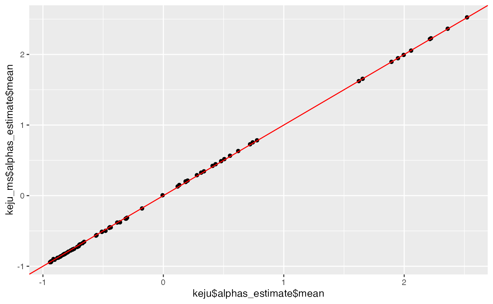
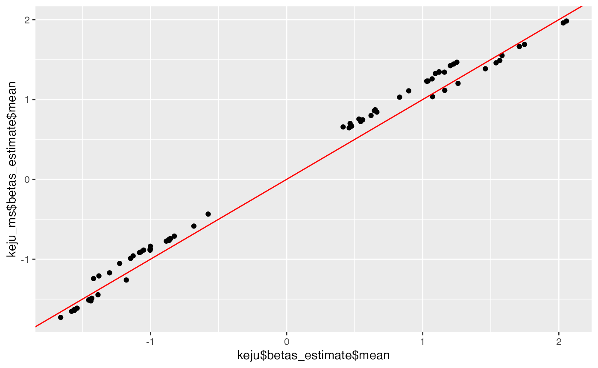

<div id="main" class="col-md-9" role="main">

# Introduction to keju

<div class="section level2">

## Introduction

keju is a set of models for statistical inference in Massively Parallel
Reporter Assay (MPRA) data. It takes in raw counts to assign each
enhancer a transcription rate and, optionally, an effect size that
denotes the difference between transcription rates in a control
treatment and an alternate treatment.

As a package, keju will filter and process your data for you before
fitting the model. Alternatively, you can provide pre-filtered counts
and skip the keju filtering step. Please just note that you must provide
raw unnormalized counts (or, at the minimum, integers).

As a note on terminology, “architecture” can be a little bit confusing.
To keju, an “architecture” is something to infer a transcription rate
and/or differential activity for. So an “architecture” can be a ref/alt
SNP pair (in which case the “control condition” would be the reference
allele and the “alternate treatment” would be the alternate allele), a
regulatory element in different conditions (think drug effect
comparison), etc.

<div class="section level3">

### Choosing the correct keju model

Choosing the correct model can be somewhat confusing. keju is not a
singular model, but a suite of models for different use cases that fit
within each other, a little like Russian nesting dolls.

To summarize the next few paragraphs,

-   the simplest modeling option is `no_motif`, and that will get you
    most of the benefits of using keju. If you’re not sure which model
    to use, you should probably at least start with `no_motif`.
-   `motif_shrinkage` is slightly more specialized version of
    `no_motif`. If architectures have some kind of shared structure
    (i.e., multiple architectures test the same transcription factor
    binding motif), `motif_shrinkage` has some statistical niceties that
    may be of interest and slightly better performance given this
    motif-level metadata.
-   `covariate_motif_slope_intercept` is a slightly more specialized
    version of `motif_shrinkage`. If you think your covariates are
    affecting the transcription rate of your architectures (i.e. minimal
    promoter choice (see our paper)), `covariate_motif_slope_intercept`
    can quantify those effects for you given motif-level and
    covariate-level metadata.

The most general model, and our default recommended starting point, is
`no_motif`. `no_motif` makes no assumptions on correlations between
enhancers or architectures, and shrinks transcription rate estimates and
effect size estimates towards a generic standard normal prior. Use
`no_motif` if you don’t have a concrete structure among your tested
architectures, which many users will not. Even if you do have some kind
of structure, `no_motif` will give you viable estimates, just without
some motif-level bells and whistles.

In contrast, some users can use `motif_shrinkage` if they have an
exploitable structure in their tested architectures. An example of
motif-level structure in the architectures is provided below from the
[Zahm et al.](https://www.nature.com/articles/s41467-024-54502-9) data,
where several architectures are all actually testing the same Rarb
transcription factor binding motif. In this case, `motif_shrinkage`
shrinks estimates towards a shared motif-level mean, and will also
provide *motif-level* estimates for transcription rate and effect sizes,
not just architecture-level estimates. For example, in the example below
`no_motif` and `motif_shrinkage` will both provide 18 transcription rate
estimates and 18 effect size estimates, one for each architecture.
However, `motif_shrinkage` will also provide a transcription rate
estimate and effect size estimate for the motif itself, and the
architecture-level estimates will be regularized to these motif-level
estimates. Use `motif_shrinkage` if you have some kind of structure
among your architectures. If you do not know if your structure
qualifies, we recommend just using `no_motif`.


Finally, the most specialized model is
`covariate_motif_slope_intercept`, also the full **keju** model.
`covariate_motif_slope_intercept` requires motif-level structure, and is
used in the case where the covariates provided in the model have
interesting effects on transcription rate that we want to disentangle.
As an example, in the [Zahm et
al.](https://www.nature.com/articles/s41467-024-54502-9) data, choice of
minimal promoter strongly affects transcription rate estimates of each
architecture (see Figure 4 in our paper). Use
`covariate_motif_slope_intercept` if you want covariate-level slope and
intercept estimates on transcription rate.

</div>

</div>

<div class="section level2">

## Usage

<div class="section level3">

### Loading the input data

We load the input data here, which contains the first 100 architectures
(in alphabetical order) of SF_DEX in our paper. This data also contains
a maximum of 20 barcodes per architecture for runtime’s sake.

<div id="cb1" class="sourceCode">

``` r
library(keju)
library(dplyr)
#> Warning: package 'dplyr' was built under R version 4.4.3
#> 
#> Attaching package: 'dplyr'
#> The following object is masked from 'package:keju':
#> 
#>     filter
#> The following objects are masked from 'package:stats':
#> 
#>     filter, lag
#> The following objects are masked from 'package:base':
#> 
#>     intersect, setdiff, setequal, union
library(stringr)

df <- readRDS(system.file("extdata", "sf_dex.rda", package="keju"))
head(df)
#>        X Unnamed..0 RNA_sample_number treatment DNA_sample_number
#> 1  11149      11149                 1        SF                42
#> 2  19492      19492                 1        SF                42
#> 3 107905     107905                 1        SF                42
#> 4 158325     158325                 1        SF                42
#> 5 176049     176049                 1        SF                42
#> 6 207146     207146                 1        SF                42
#>                    barcode DNA_count  DNA_rpm                 architecture
#> 1 GCTTCCTTGTTAGTTATTAAGATA       392 4.413638 ALX3-1:1223, 1, set2, minCMV
#> 2 AAGTGTTTGCGTCAACCTTACAAA       341 3.839415 ALX3-1:1223, 1, set2, minCMV
#> 3 CCTTCCCACATACTACGACATGCA       182 2.049189 ALX3-1:1223, 1, set2, minCMV
#> 4 GATTCTGACTGGGATCTGAATTCC       146 1.643855 ALX3-1:1223, 1, set2, minCMV
#> 5 ATTGATTAAATATAAAGGTATACC       135 1.520003 ALX3-1:1223, 1, set2, minCMV
#> 6 CTTAGTTAGTTTCTCGGGACTTTG       118 1.328595 ALX3-1:1223, 1, set2, minCMV
#>       class barcode_n RNA_count   RNA_rpm
#> 1 candidate         1        39 1.6640826
#> 2 candidate         2        94 4.0108659
#> 3 candidate         3        34 1.4507387
#> 4 candidate         4         7 0.2986815
#> 5 candidate         5         5 0.2133439
#> 6 candidate         6        39 1.6640826
```

</div>

Here, we mark the control treatment (SF, denoting “Serum Free”) and the
negative control architectures. keju uses negative controls to correct
for global shifts in differential activity, and can do so in a
covariate-specific manner. We also provide the covariates we want to
correct effect sizes with (in this case, it’s the minimal promoter used
in the architecture).

<div id="cb2" class="sourceCode">

``` r
df$is_control_treatment = (df$treatment == 'SF')
df$is_control_architecture = (df$class == 'scramble' | df$class == 'spacer')
df$covariates = str_split_fixed(df$architecture, ', ', 4)[, 4]
```

</div>

</div>

<div class="section level3">

### no_motif

This section details running keju in the no_motif setting. For
motif_shrinkage or covariate_motif_slope_intercept, there are other
sections below. Note that the processing step also changes between
different models.

Here, we build the keju object from our data. In our case, we have a
control treatment (SF) and an alternate treatment (Dex), and are
interested in differential activity between the two (hence,
infer_differential_activity=TRUE). If you only have a single treatment,
and are only interested in baseline transcription rate in that single
treatment, simply set infer_differential_activity = FALSE.

Note that the DNA and RNA counts are matched by (barcode, RNA batch),
and every argument in keju_from_counts is a length N vector (or castable
to a length N vector), where N is the number of observations. In our
experiment, we have 100 architectures, where each architecture has a
maximum of 20 barcodes, and has observations in two RNA batches. This
comes out to be 8230 observations, where each observation has the same
barcode and RNA batch, but not necessarily the same DNA batch or DNA
counts (but they can be the same!).

If this is the first time you have run keju, basilisk will install a
conda environment with the necessary prerequisites for you.

<div id="cb3" class="sourceCode">

``` r
# build the keju object
keju <- keju_from_counts(
    barcode=df$barcode,
    R = df$RNA_count,
    D = df$DNA_count,
    batch = df$RNA_sample_number,
    dna_batch = df$DNA_sample_number,
    architecture = df$architecture,
    treatment = df$treatment,
    is_control_treatment = df$is_control_treatment,
    is_control_architecture = df$is_control_architecture,
    covariates=df$covariates
)

# optional filtering step
keju <- keju::filter(keju)
#> Converting 425 NA values to zero
#> Filtering 30 architectures with insufficient barcodes.

# process the filtered data to fit no_motif
keju <- use_no_motif(keju, infer_differential_activity = TRUE)
```

</div>

Here we set the output directory for our model outputs. keju will
automatically create this directory if it finds it missing. Nicely
processed estimates will be output here.

Since we are interested in the no_motif model in this subsection, we set
model=‘no_motif’. Fitting this toy dataset only takes a few minutes, but
it can take hours on a full size dataset. Generally speaking, keju also
requires the use of four cores, one per fit chain. Otherwise it will fit
the chains serially (see cmdstanr documentation for more).

<div id="cb4" class="sourceCode">

``` r
output_dir <- 'keju_vignette'

# fit no_motif
keju <- keju_fit(keju, output_dir=paste0(output_dir, '/no_motif'), model='no_motif', infer_differential_activity=TRUE)
#> Running MCMC with 4 parallel chains...
#> 
#> Chain 1 Iteration:    1 / 2000 [  0%]  (Warmup) 
#> Chain 2 Iteration:    1 / 2000 [  0%]  (Warmup) 
#> Chain 3 Iteration:    1 / 2000 [  0%]  (Warmup) 
#> Chain 4 Iteration:    1 / 2000 [  0%]  (Warmup) 
#> Chain 3 Iteration:  100 / 2000 [  5%]  (Warmup) 
#> Chain 4 Iteration:  100 / 2000 [  5%]  (Warmup) 
#> Chain 1 Iteration:  100 / 2000 [  5%]  (Warmup) 
#> Chain 2 Iteration:  100 / 2000 [  5%]  (Warmup) 
#> Chain 1 Iteration:  200 / 2000 [ 10%]  (Warmup) 
#> Chain 2 Iteration:  200 / 2000 [ 10%]  (Warmup) 
#> Chain 4 Iteration:  200 / 2000 [ 10%]  (Warmup) 
#> Chain 3 Iteration:  200 / 2000 [ 10%]  (Warmup) 
#> Chain 1 Iteration:  300 / 2000 [ 15%]  (Warmup) 
#> Chain 3 Iteration:  300 / 2000 [ 15%]  (Warmup) 
#> Chain 2 Iteration:  300 / 2000 [ 15%]  (Warmup) 
#> Chain 4 Iteration:  300 / 2000 [ 15%]  (Warmup) 
#> Chain 1 Iteration:  400 / 2000 [ 20%]  (Warmup) 
#> Chain 3 Iteration:  400 / 2000 [ 20%]  (Warmup) 
#> Chain 4 Iteration:  400 / 2000 [ 20%]  (Warmup) 
#> Chain 1 Iteration:  500 / 2000 [ 25%]  (Warmup) 
#> Chain 2 Iteration:  400 / 2000 [ 20%]  (Warmup) 
#> Chain 3 Iteration:  500 / 2000 [ 25%]  (Warmup) 
#> Chain 4 Iteration:  500 / 2000 [ 25%]  (Warmup) 
#> Chain 1 Iteration:  600 / 2000 [ 30%]  (Warmup) 
#> Chain 2 Iteration:  500 / 2000 [ 25%]  (Warmup) 
#> Chain 4 Iteration:  600 / 2000 [ 30%]  (Warmup) 
#> Chain 1 Iteration:  700 / 2000 [ 35%]  (Warmup) 
#> Chain 3 Iteration:  600 / 2000 [ 30%]  (Warmup) 
#> Chain 2 Iteration:  600 / 2000 [ 30%]  (Warmup) 
#> Chain 1 Iteration:  800 / 2000 [ 40%]  (Warmup) 
#> Chain 4 Iteration:  700 / 2000 [ 35%]  (Warmup) 
#> Chain 3 Iteration:  700 / 2000 [ 35%]  (Warmup) 
#> Chain 2 Iteration:  700 / 2000 [ 35%]  (Warmup) 
#> Chain 1 Iteration:  900 / 2000 [ 45%]  (Warmup) 
#> Chain 4 Iteration:  800 / 2000 [ 40%]  (Warmup) 
#> Chain 3 Iteration:  800 / 2000 [ 40%]  (Warmup) 
#> Chain 2 Iteration:  800 / 2000 [ 40%]  (Warmup) 
#> Chain 1 Iteration: 1000 / 2000 [ 50%]  (Warmup) 
#> Chain 1 Iteration: 1001 / 2000 [ 50%]  (Sampling) 
#> Chain 4 Iteration:  900 / 2000 [ 45%]  (Warmup) 
#> Chain 3 Iteration:  900 / 2000 [ 45%]  (Warmup) 
#> Chain 2 Iteration:  900 / 2000 [ 45%]  (Warmup) 
#> Chain 4 Iteration: 1000 / 2000 [ 50%]  (Warmup) 
#> Chain 4 Iteration: 1001 / 2000 [ 50%]  (Sampling) 
#> Chain 3 Iteration: 1000 / 2000 [ 50%]  (Warmup) 
#> Chain 3 Iteration: 1001 / 2000 [ 50%]  (Sampling) 
#> Chain 2 Iteration: 1000 / 2000 [ 50%]  (Warmup) 
#> Chain 2 Iteration: 1001 / 2000 [ 50%]  (Sampling) 
#> Chain 3 Iteration: 1100 / 2000 [ 55%]  (Sampling) 
#> Chain 1 Iteration: 1100 / 2000 [ 55%]  (Sampling) 
#> Chain 3 Iteration: 1200 / 2000 [ 60%]  (Sampling) 
#> Chain 4 Iteration: 1100 / 2000 [ 55%]  (Sampling) 
#> Chain 2 Iteration: 1100 / 2000 [ 55%]  (Sampling) 
#> Chain 3 Iteration: 1300 / 2000 [ 65%]  (Sampling) 
#> Chain 3 Iteration: 1400 / 2000 [ 70%]  (Sampling) 
#> Chain 4 Iteration: 1200 / 2000 [ 60%]  (Sampling) 
#> Chain 2 Iteration: 1200 / 2000 [ 60%]  (Sampling) 
#> Chain 1 Iteration: 1200 / 2000 [ 60%]  (Sampling) 
#> Chain 3 Iteration: 1500 / 2000 [ 75%]  (Sampling) 
#> Chain 3 Iteration: 1600 / 2000 [ 80%]  (Sampling) 
#> Chain 2 Iteration: 1300 / 2000 [ 65%]  (Sampling) 
#> Chain 4 Iteration: 1300 / 2000 [ 65%]  (Sampling) 
#> Chain 3 Iteration: 1700 / 2000 [ 85%]  (Sampling) 
#> Chain 1 Iteration: 1300 / 2000 [ 65%]  (Sampling) 
#> Chain 3 Iteration: 1800 / 2000 [ 90%]  (Sampling) 
#> Chain 2 Iteration: 1400 / 2000 [ 70%]  (Sampling) 
#> Chain 3 Iteration: 1900 / 2000 [ 95%]  (Sampling) 
#> Chain 4 Iteration: 1400 / 2000 [ 70%]  (Sampling) 
#> Chain 3 Iteration: 2000 / 2000 [100%]  (Sampling) 
#> Chain 3 finished in 93.5 seconds.
#> Chain 1 Iteration: 1400 / 2000 [ 70%]  (Sampling) 
#> Chain 2 Iteration: 1500 / 2000 [ 75%]  (Sampling) 
#> Chain 4 Iteration: 1500 / 2000 [ 75%]  (Sampling) 
#> Chain 2 Iteration: 1600 / 2000 [ 80%]  (Sampling) 
#> Chain 1 Iteration: 1500 / 2000 [ 75%]  (Sampling) 
#> Chain 4 Iteration: 1600 / 2000 [ 80%]  (Sampling) 
#> Chain 2 Iteration: 1700 / 2000 [ 85%]  (Sampling) 
#> Chain 1 Iteration: 1600 / 2000 [ 80%]  (Sampling) 
#> Chain 2 Iteration: 1800 / 2000 [ 90%]  (Sampling) 
#> Chain 4 Iteration: 1700 / 2000 [ 85%]  (Sampling) 
#> Chain 2 Iteration: 1900 / 2000 [ 95%]  (Sampling) 
#> Chain 1 Iteration: 1700 / 2000 [ 85%]  (Sampling) 
#> Chain 4 Iteration: 1800 / 2000 [ 90%]  (Sampling) 
#> Chain 2 Iteration: 2000 / 2000 [100%]  (Sampling) 
#> Chain 2 finished in 145.2 seconds.
#> Chain 4 Iteration: 1900 / 2000 [ 95%]  (Sampling) 
#> Chain 1 Iteration: 1800 / 2000 [ 90%]  (Sampling) 
#> Chain 4 Iteration: 2000 / 2000 [100%]  (Sampling) 
#> Chain 4 finished in 163.9 seconds.
#> Chain 1 Iteration: 1900 / 2000 [ 95%]  (Sampling) 
#> Chain 1 Iteration: 2000 / 2000 [100%]  (Sampling) 
#> Chain 1 finished in 181.7 seconds.
#> 
#> All 4 chains finished successfully.
#> Mean chain execution time: 146.1 seconds.
#> Total execution time: 181.7 seconds.
#> Warning: 8 of 4000 (0.0%) transitions hit the maximum treedepth limit of 10.
#> See https://mc-stan.org/misc/warnings for details.
#> 
#> Warning: 8 of 4000 (0.0%) transitions hit the maximum treedepth limit of 10.
#> See https://mc-stan.org/misc/warnings for details.
#> $num_divergent
#> [1] 0 0 0 0
#> 
#> $num_max_treedepth
#> [1] 5 0 0 3
#> 
#> $ebfmi
#> [1] 0.9536814 1.0435768 0.9728513 1.0570126
#> Warning: Setting row names on a tibble is deprecated.
#> Setting row names on a tibble is deprecated.
#> Setting row names on a tibble is deprecated.
#> Setting row names on a tibble is deprecated.
```

</div>

</div>

<div class="section level3">

### motif_shrinkage

This section details usage of the model motif_shrinkage. Note that both
the preprocessing and fitting steps change slightly.

Because we are using motif-level information, we need to provide the
appropriate metadata for preprocessing. Note that here, we are providing
the motif-level information in keju_from_counts.

<div id="cb5" class="sourceCode">

``` r
df$motif = str_split_fixed(df$architecture, ':', 2)[, 1]

keju_ms <- keju_from_counts(
    barcode=df$barcode,
    R = df$RNA_count,
    D = df$DNA_count,
    batch = df$RNA_sample_number,
    dna_batch = df$DNA_sample_number,
    architecture = df$architecture,
    treatment = df$treatment,
    is_control_treatment = df$is_control_treatment,
    is_control_architecture = df$is_control_architecture,
    covariates = df$covariates,
    motif = df$motif
)
```

</div>

We still need to filter the counts, but the processing function we call
is different (use_motif_shrinkage instead of use_no_motif).

<div id="cb6" class="sourceCode">

``` r
keju_ms <- keju::filter(keju_ms)
#> Converting 425 NA values to zero
#> Filtering 30 architectures with insufficient barcodes.
keju_ms <- use_motif_shrinkage(keju_ms, infer_differential_activity = TRUE)
```

</div>

Finally, we specify motif_shrinkage through the model argument.

<div id="cb7" class="sourceCode">

``` r
keju_ms <- keju_fit(keju_ms, paste0(output_dir, '/motif_shrinkage'), model='motif_shrinkage', infer_differential_activity=TRUE)
#> Running MCMC with 4 parallel chains...
#> 
#> Chain 1 Iteration:    1 / 2000 [  0%]  (Warmup) 
#> Chain 2 Iteration:    1 / 2000 [  0%]  (Warmup) 
#> Chain 3 Iteration:    1 / 2000 [  0%]  (Warmup) 
#> Chain 4 Iteration:    1 / 2000 [  0%]  (Warmup) 
#> Chain 3 Iteration:  100 / 2000 [  5%]  (Warmup) 
#> Chain 4 Iteration:  100 / 2000 [  5%]  (Warmup) 
#> Chain 1 Iteration:  100 / 2000 [  5%]  (Warmup) 
#> Chain 2 Iteration:  100 / 2000 [  5%]  (Warmup) 
#> Chain 3 Iteration:  200 / 2000 [ 10%]  (Warmup) 
#> Chain 1 Iteration:  200 / 2000 [ 10%]  (Warmup) 
#> Chain 2 Iteration:  200 / 2000 [ 10%]  (Warmup) 
#> Chain 4 Iteration:  200 / 2000 [ 10%]  (Warmup) 
#> Chain 3 Iteration:  300 / 2000 [ 15%]  (Warmup) 
#> Chain 2 Iteration:  300 / 2000 [ 15%]  (Warmup) 
#> Chain 3 Iteration:  400 / 2000 [ 20%]  (Warmup) 
#> Chain 1 Iteration:  300 / 2000 [ 15%]  (Warmup) 
#> Chain 4 Iteration:  300 / 2000 [ 15%]  (Warmup) 
#> Chain 2 Iteration:  400 / 2000 [ 20%]  (Warmup) 
#> Chain 4 Iteration:  400 / 2000 [ 20%]  (Warmup) 
#> Chain 3 Iteration:  500 / 2000 [ 25%]  (Warmup) 
#> Chain 1 Iteration:  400 / 2000 [ 20%]  (Warmup) 
#> Chain 2 Iteration:  500 / 2000 [ 25%]  (Warmup) 
#> Chain 3 Iteration:  600 / 2000 [ 30%]  (Warmup) 
#> Chain 4 Iteration:  500 / 2000 [ 25%]  (Warmup) 
#> Chain 1 Iteration:  500 / 2000 [ 25%]  (Warmup) 
#> Chain 3 Iteration:  700 / 2000 [ 35%]  (Warmup) 
#> Chain 2 Iteration:  600 / 2000 [ 30%]  (Warmup) 
#> Chain 1 Iteration:  600 / 2000 [ 30%]  (Warmup) 
#> Chain 4 Iteration:  600 / 2000 [ 30%]  (Warmup) 
#> Chain 3 Iteration:  800 / 2000 [ 40%]  (Warmup) 
#> Chain 2 Iteration:  700 / 2000 [ 35%]  (Warmup) 
#> Chain 1 Iteration:  700 / 2000 [ 35%]  (Warmup) 
#> Chain 4 Iteration:  700 / 2000 [ 35%]  (Warmup) 
#> Chain 3 Iteration:  900 / 2000 [ 45%]  (Warmup) 
#> Chain 2 Iteration:  800 / 2000 [ 40%]  (Warmup) 
#> Chain 1 Iteration:  800 / 2000 [ 40%]  (Warmup) 
#> Chain 4 Iteration:  800 / 2000 [ 40%]  (Warmup) 
#> Chain 3 Iteration: 1000 / 2000 [ 50%]  (Warmup) 
#> Chain 3 Iteration: 1001 / 2000 [ 50%]  (Sampling) 
#> Chain 2 Iteration:  900 / 2000 [ 45%]  (Warmup) 
#> Chain 1 Iteration:  900 / 2000 [ 45%]  (Warmup) 
#> Chain 4 Iteration:  900 / 2000 [ 45%]  (Warmup) 
#> Chain 3 Iteration: 1100 / 2000 [ 55%]  (Sampling) 
#> Chain 2 Iteration: 1000 / 2000 [ 50%]  (Warmup) 
#> Chain 2 Iteration: 1001 / 2000 [ 50%]  (Sampling) 
#> Chain 1 Iteration: 1000 / 2000 [ 50%]  (Warmup) 
#> Chain 1 Iteration: 1001 / 2000 [ 50%]  (Sampling) 
#> Chain 3 Iteration: 1200 / 2000 [ 60%]  (Sampling) 
#> Chain 4 Iteration: 1000 / 2000 [ 50%]  (Warmup) 
#> Chain 4 Iteration: 1001 / 2000 [ 50%]  (Sampling) 
#> Chain 2 Iteration: 1100 / 2000 [ 55%]  (Sampling) 
#> Chain 1 Iteration: 1100 / 2000 [ 55%]  (Sampling) 
#> Chain 3 Iteration: 1300 / 2000 [ 65%]  (Sampling) 
#> Chain 4 Iteration: 1100 / 2000 [ 55%]  (Sampling) 
#> Chain 2 Iteration: 1200 / 2000 [ 60%]  (Sampling) 
#> Chain 1 Iteration: 1200 / 2000 [ 60%]  (Sampling) 
#> Chain 3 Iteration: 1400 / 2000 [ 70%]  (Sampling) 
#> Chain 4 Iteration: 1200 / 2000 [ 60%]  (Sampling) 
#> Chain 2 Iteration: 1300 / 2000 [ 65%]  (Sampling) 
#> Chain 1 Iteration: 1300 / 2000 [ 65%]  (Sampling) 
#> Chain 3 Iteration: 1500 / 2000 [ 75%]  (Sampling) 
#> Chain 4 Iteration: 1300 / 2000 [ 65%]  (Sampling) 
#> Chain 2 Iteration: 1400 / 2000 [ 70%]  (Sampling) 
#> Chain 1 Iteration: 1400 / 2000 [ 70%]  (Sampling) 
#> Chain 3 Iteration: 1600 / 2000 [ 80%]  (Sampling) 
#> Chain 4 Iteration: 1400 / 2000 [ 70%]  (Sampling) 
#> Chain 2 Iteration: 1500 / 2000 [ 75%]  (Sampling) 
#> Chain 1 Iteration: 1500 / 2000 [ 75%]  (Sampling) 
#> Chain 3 Iteration: 1700 / 2000 [ 85%]  (Sampling) 
#> Chain 4 Iteration: 1500 / 2000 [ 75%]  (Sampling) 
#> Chain 2 Iteration: 1600 / 2000 [ 80%]  (Sampling) 
#> Chain 1 Iteration: 1600 / 2000 [ 80%]  (Sampling) 
#> Chain 3 Iteration: 1800 / 2000 [ 90%]  (Sampling) 
#> Chain 4 Iteration: 1600 / 2000 [ 80%]  (Sampling) 
#> Chain 2 Iteration: 1700 / 2000 [ 85%]  (Sampling) 
#> Chain 1 Iteration: 1700 / 2000 [ 85%]  (Sampling) 
#> Chain 3 Iteration: 1900 / 2000 [ 95%]  (Sampling) 
#> Chain 4 Iteration: 1700 / 2000 [ 85%]  (Sampling) 
#> Chain 2 Iteration: 1800 / 2000 [ 90%]  (Sampling) 
#> Chain 1 Iteration: 1800 / 2000 [ 90%]  (Sampling) 
#> Chain 3 Iteration: 2000 / 2000 [100%]  (Sampling) 
#> Chain 3 finished in 99.2 seconds.
#> Chain 4 Iteration: 1800 / 2000 [ 90%]  (Sampling) 
#> Chain 2 Iteration: 1900 / 2000 [ 95%]  (Sampling) 
#> Chain 1 Iteration: 1900 / 2000 [ 95%]  (Sampling) 
#> Chain 4 Iteration: 1900 / 2000 [ 95%]  (Sampling) 
#> Chain 2 Iteration: 2000 / 2000 [100%]  (Sampling) 
#> Chain 2 finished in 105.7 seconds.
#> Chain 1 Iteration: 2000 / 2000 [100%]  (Sampling) 
#> Chain 1 finished in 108.2 seconds.
#> Chain 4 Iteration: 2000 / 2000 [100%]  (Sampling) 
#> Chain 4 finished in 109.3 seconds.
#> 
#> All 4 chains finished successfully.
#> Mean chain execution time: 105.6 seconds.
#> Total execution time: 109.4 seconds.
#> 
#> $num_divergent
#> [1] 0 0 0 0
#> 
#> $num_max_treedepth
#> [1] 0 0 0 0
#> 
#> $ebfmi
#> [1] 0.9976810 1.0551858 0.9785017 1.0254429
#> Warning: Setting row names on a tibble is deprecated.
#> Setting row names on a tibble is deprecated.
#> Setting row names on a tibble is deprecated.
#> Setting row names on a tibble is deprecated.
#> Setting row names on a tibble is deprecated.
#> Setting row names on a tibble is deprecated.
```

</div>

</div>

<div class="section level3">

### covariate_motif_slope_intercept

This section details usage of the model covariate_motif_slope_intercept.
We against start with creating the keju object and filtering counts.

<div id="cb8" class="sourceCode">

``` r
keju_cmsi <- keju_from_counts(
    barcode=df$barcode,
    R = df$RNA_count,
    D = df$DNA_count,
    batch = df$RNA_sample_number,
    dna_batch = df$DNA_sample_number,
    architecture = df$architecture,
    treatment = df$treatment,
    is_control_treatment = df$is_control_treatment,
    is_control_architecture = df$is_control_architecture,
    covariates = df$covariates,
    motif = df$motif
)

keju_cmsi <- keju::filter(keju_cmsi)
#> Converting 425 NA values to zero
#> Filtering 30 architectures with insufficient barcodes.
```

</div>

Maybe predictably, the preprocessing function we use is
use_covariate_slope_intercept instead of use_no_motif or
use_motif_shrinkage.

<div id="cb9" class="sourceCode">

``` r
keju_cmsi <- use_covariate_slope_intercept(keju_cmsi, infer_differential_activity = TRUE)
```

</div>

We then fit the model, again specifying covariate_motif_slope_intercept
through the model argument.

<div id="cb10" class="sourceCode">

``` r
keju_cmsi <- keju_fit(keju_cmsi, paste0(output_dir, '/covariate_motif_slope_intercept'), 
                 model='covariate_motif_slope_intercept', 
                 infer_differential_activity=TRUE)
#> Running MCMC with 4 parallel chains...
#> 
#> Chain 1 Iteration:    1 / 2000 [  0%]  (Warmup) 
#> Chain 2 Iteration:    1 / 2000 [  0%]  (Warmup) 
#> Chain 3 Iteration:    1 / 2000 [  0%]  (Warmup) 
#> Chain 4 Iteration:    1 / 2000 [  0%]  (Warmup) 
#> Chain 1 Iteration:  100 / 2000 [  5%]  (Warmup) 
#> Chain 3 Iteration:  100 / 2000 [  5%]  (Warmup) 
#> Chain 4 Iteration:  100 / 2000 [  5%]  (Warmup) 
#> Chain 2 Iteration:  100 / 2000 [  5%]  (Warmup) 
#> Chain 1 Iteration:  200 / 2000 [ 10%]  (Warmup) 
#> Chain 3 Iteration:  200 / 2000 [ 10%]  (Warmup) 
#> Chain 4 Iteration:  200 / 2000 [ 10%]  (Warmup) 
#> Chain 2 Iteration:  200 / 2000 [ 10%]  (Warmup) 
#> Chain 1 Iteration:  300 / 2000 [ 15%]  (Warmup) 
#> Chain 3 Iteration:  300 / 2000 [ 15%]  (Warmup) 
#> Chain 2 Iteration:  300 / 2000 [ 15%]  (Warmup) 
#> Chain 1 Iteration:  400 / 2000 [ 20%]  (Warmup) 
#> Chain 4 Iteration:  300 / 2000 [ 15%]  (Warmup) 
#> Chain 3 Iteration:  400 / 2000 [ 20%]  (Warmup) 
#> Chain 1 Iteration:  500 / 2000 [ 25%]  (Warmup) 
#> Chain 2 Iteration:  400 / 2000 [ 20%]  (Warmup) 
#> Chain 4 Iteration:  400 / 2000 [ 20%]  (Warmup) 
#> Chain 3 Iteration:  500 / 2000 [ 25%]  (Warmup) 
#> Chain 2 Iteration:  500 / 2000 [ 25%]  (Warmup) 
#> Chain 1 Iteration:  600 / 2000 [ 30%]  (Warmup) 
#> Chain 4 Iteration:  500 / 2000 [ 25%]  (Warmup) 
#> Chain 3 Iteration:  600 / 2000 [ 30%]  (Warmup) 
#> Chain 1 Iteration:  700 / 2000 [ 35%]  (Warmup) 
#> Chain 2 Iteration:  600 / 2000 [ 30%]  (Warmup) 
#> Chain 4 Iteration:  600 / 2000 [ 30%]  (Warmup) 
#> Chain 3 Iteration:  700 / 2000 [ 35%]  (Warmup) 
#> Chain 1 Iteration:  800 / 2000 [ 40%]  (Warmup) 
#> Chain 2 Iteration:  700 / 2000 [ 35%]  (Warmup) 
#> Chain 4 Iteration:  700 / 2000 [ 35%]  (Warmup) 
#> Chain 3 Iteration:  800 / 2000 [ 40%]  (Warmup) 
#> Chain 2 Iteration:  800 / 2000 [ 40%]  (Warmup) 
#> Chain 1 Iteration:  900 / 2000 [ 45%]  (Warmup) 
#> Chain 4 Iteration:  800 / 2000 [ 40%]  (Warmup) 
#> Chain 3 Iteration:  900 / 2000 [ 45%]  (Warmup) 
#> Chain 2 Iteration:  900 / 2000 [ 45%]  (Warmup) 
#> Chain 1 Iteration: 1000 / 2000 [ 50%]  (Warmup) 
#> Chain 1 Iteration: 1001 / 2000 [ 50%]  (Sampling) 
#> Chain 4 Iteration:  900 / 2000 [ 45%]  (Warmup) 
#> Chain 3 Iteration: 1000 / 2000 [ 50%]  (Warmup) 
#> Chain 3 Iteration: 1001 / 2000 [ 50%]  (Sampling) 
#> Chain 2 Iteration: 1000 / 2000 [ 50%]  (Warmup) 
#> Chain 2 Iteration: 1001 / 2000 [ 50%]  (Sampling) 
#> Chain 1 Iteration: 1100 / 2000 [ 55%]  (Sampling) 
#> Chain 4 Iteration: 1000 / 2000 [ 50%]  (Warmup) 
#> Chain 4 Iteration: 1001 / 2000 [ 50%]  (Sampling) 
#> Chain 3 Iteration: 1100 / 2000 [ 55%]  (Sampling) 
#> Chain 2 Iteration: 1100 / 2000 [ 55%]  (Sampling) 
#> Chain 1 Iteration: 1200 / 2000 [ 60%]  (Sampling) 
#> Chain 4 Iteration: 1100 / 2000 [ 55%]  (Sampling) 
#> Chain 3 Iteration: 1200 / 2000 [ 60%]  (Sampling) 
#> Chain 2 Iteration: 1200 / 2000 [ 60%]  (Sampling) 
#> Chain 1 Iteration: 1300 / 2000 [ 65%]  (Sampling) 
#> Chain 4 Iteration: 1200 / 2000 [ 60%]  (Sampling) 
#> Chain 3 Iteration: 1300 / 2000 [ 65%]  (Sampling) 
#> Chain 2 Iteration: 1300 / 2000 [ 65%]  (Sampling) 
#> Chain 1 Iteration: 1400 / 2000 [ 70%]  (Sampling) 
#> Chain 4 Iteration: 1300 / 2000 [ 65%]  (Sampling) 
#> Chain 3 Iteration: 1400 / 2000 [ 70%]  (Sampling) 
#> Chain 2 Iteration: 1400 / 2000 [ 70%]  (Sampling) 
#> Chain 1 Iteration: 1500 / 2000 [ 75%]  (Sampling) 
#> Chain 4 Iteration: 1400 / 2000 [ 70%]  (Sampling) 
#> Chain 3 Iteration: 1500 / 2000 [ 75%]  (Sampling) 
#> Chain 2 Iteration: 1500 / 2000 [ 75%]  (Sampling) 
#> Chain 1 Iteration: 1600 / 2000 [ 80%]  (Sampling) 
#> Chain 4 Iteration: 1500 / 2000 [ 75%]  (Sampling) 
#> Chain 3 Iteration: 1600 / 2000 [ 80%]  (Sampling) 
#> Chain 2 Iteration: 1600 / 2000 [ 80%]  (Sampling) 
#> Chain 1 Iteration: 1700 / 2000 [ 85%]  (Sampling) 
#> Chain 4 Iteration: 1600 / 2000 [ 80%]  (Sampling) 
#> Chain 3 Iteration: 1700 / 2000 [ 85%]  (Sampling) 
#> Chain 2 Iteration: 1700 / 2000 [ 85%]  (Sampling) 
#> Chain 1 Iteration: 1800 / 2000 [ 90%]  (Sampling) 
#> Chain 4 Iteration: 1700 / 2000 [ 85%]  (Sampling) 
#> Chain 3 Iteration: 1800 / 2000 [ 90%]  (Sampling) 
#> Chain 2 Iteration: 1800 / 2000 [ 90%]  (Sampling) 
#> Chain 1 Iteration: 1900 / 2000 [ 95%]  (Sampling) 
#> Chain 4 Iteration: 1800 / 2000 [ 90%]  (Sampling) 
#> Chain 3 Iteration: 1900 / 2000 [ 95%]  (Sampling) 
#> Chain 2 Iteration: 1900 / 2000 [ 95%]  (Sampling) 
#> Chain 1 Iteration: 2000 / 2000 [100%]  (Sampling) 
#> Chain 1 finished in 101.5 seconds.
#> Chain 4 Iteration: 1900 / 2000 [ 95%]  (Sampling) 
#> Chain 3 Iteration: 2000 / 2000 [100%]  (Sampling) 
#> Chain 3 finished in 104.1 seconds.
#> Chain 2 Iteration: 2000 / 2000 [100%]  (Sampling) 
#> Chain 2 finished in 105.6 seconds.
#> Chain 4 Iteration: 2000 / 2000 [100%]  (Sampling) 
#> Chain 4 finished in 107.6 seconds.
#> 
#> All 4 chains finished successfully.
#> Mean chain execution time: 104.7 seconds.
#> Total execution time: 107.8 seconds.
#> 
#> $num_divergent
#> [1] 0 0 0 0
#> 
#> $num_max_treedepth
#> [1] 0 0 0 0
#> 
#> $ebfmi
#> [1] 1.0016497 0.9916731 0.9401170 0.9802777
#> Warning: Setting row names on a tibble is deprecated.
#> Setting row names on a tibble is deprecated.
#> Setting row names on a tibble is deprecated.
#> Setting row names on a tibble is deprecated.
#> Setting row names on a tibble is deprecated.
#> Setting row names on a tibble is deprecated.
#> Setting row names on a tibble is deprecated.
#> Setting row names on a tibble is deprecated.
```

</div>

</div>

<div class="section level3">

### Accessing estimates

keju provides both transcription rate estimates (alpha) and effect
size/differential activity estimates (beta). We can access both
estimates as shown below. The most important columns here are mean (the
mean estimate), sd (standard deviation of estimate), and is_significant.

<div id="cb11" class="sourceCode">

``` r
# alpha estimates
head(keju$alphas_estimate)
#> # A tibble: 6 × 11
#>   variable   mean median     sd    mad     q5     q95  rhat ess_bulk ess_tail
#>   <chr>     <dbl>  <dbl>  <dbl>  <dbl>  <dbl>   <dbl> <dbl>    <dbl>    <dbl>
#> 1 alpha[1] -0.383 -0.385 0.0884 0.0877 -0.524 -0.236   1.00    5118.    2706.
#> 2 alpha[2] -0.177 -0.178 0.0829 0.0846 -0.315 -0.0413  1.00    5032.    3009.
#> 3 alpha[3] -0.913 -0.913 0.0850 0.0855 -1.05  -0.772   1.00    4492.    2971.
#> 4 alpha[4] -0.658 -0.657 0.0756 0.0756 -0.781 -0.531   1.00    4643.    3348.
#> 5 alpha[5] -0.444 -0.445 0.0842 0.0819 -0.580 -0.306   1.00    4636.    2599.
#> 6 alpha[6] -0.692 -0.692 0.0711 0.0717 -0.809 -0.576   1.00    5498.    2871.
#> # ℹ 1 more variable: architecture <chr>

# beta estimates
head(keju$betas_estimate)
#> # A tibble: 6 × 12
#>   variable   mean median    sd   mad    q5    q95  rhat ess_bulk ess_tail
#>   <chr>     <dbl>  <dbl> <dbl> <dbl> <dbl>  <dbl> <dbl>    <dbl>    <dbl>
#> 1 beta[1]  -1.18  -1.18  0.266 0.264 -1.61 -0.739  1.00    2019.    2899.
#> 2 beta[2]  -1.54  -1.54  0.261 0.264 -1.96 -1.10   1.00    1930.    2502.
#> 3 beta[3]  -0.576 -0.572 0.275 0.280 -1.03 -0.123  1.00    2019.    2814.
#> 4 beta[4]  -1.30  -1.30  0.269 0.263 -1.75 -0.855  1.00    2105.    2714.
#> 5 beta[5]  -1.44  -1.44  0.258 0.259 -1.85 -1.01   1.01    1979.    2244.
#> 6 beta[6]  -1.00  -0.997 0.255 0.255 -1.43 -0.593  1.00    2203.    2564.
#> # ℹ 2 more variables: is_significant <lgl>, architecture <chr>
```

</div>

Note that the estimates are fairly consistent between model type, even
without motif information. Using motif information improves inference,
but is not strictly necessary for keju performance.

<div id="cb12" class="sourceCode">

``` r
p1 <- ggplot(mapping=aes(x=keju$alphas_estimate$mean, y=keju_ms$alphas_estimate$mean)) + geom_point() + geom_abline(slope=1, intercept=0, color='red')
print(p1)
```

</div>



<div id="cb13" class="sourceCode">

``` r
p2 <- ggplot(mapping=aes(x=keju$betas_estimate$mean, y=keju_ms$betas_estimate$mean)) + geom_point() + geom_abline(slope=1, intercept=0, color='red')
print(p2)
```

</div>



For models with motif-level information (motif_shrinkage and
covariate_motif_slope_intercept), we can access motif-level estimates in
the manner shown below.

<div id="cb14" class="sourceCode">

``` r
# transcription rate motif estimates
head(keju_ms$alpha_motifs_estimate)
#> # A tibble: 6 × 11
#>   variable      mean median     sd    mad     q5     q95  rhat ess_bulk ess_tail
#>   <chr>        <dbl>  <dbl>  <dbl>  <dbl>  <dbl>   <dbl> <dbl>    <dbl>    <dbl>
#> 1 motif_tran… -0.169 -0.176 0.735  0.696  -1.36   1.06   1.00     4956.    3093.
#> 2 motif_tran… -0.518 -0.525 0.308  0.283  -0.998 -0.0143 1.00     3380.    2506.
#> 3 motif_tran… -0.731 -0.733 0.0907 0.0882 -0.878 -0.579  1.000    5209.    2660.
#> 4 motif_tran… -0.672 -0.672 0.0992 0.0958 -0.838 -0.507  1.00     4353.    3019.
#> 5 motif_tran…  0.774  0.776 0.208  0.206   0.439  1.11   1.00     4720.    2813.
#> 6 motif_tran…  1.19   1.21  0.311  0.285   0.663  1.69   1.00     4029.    2407.
#> # ℹ 1 more variable: motif <chr>

# effect size motif estimates
head(keju_ms$beta_motifs_estimate)
#> # A tibble: 6 × 12
#>   variable         mean median    sd   mad     q5    q95  rhat ess_bulk ess_tail
#>   <chr>           <dbl>  <dbl> <dbl> <dbl>  <dbl>  <dbl> <dbl>    <dbl>    <dbl>
#> 1 motif_effect[… -0.547 -0.599 0.820 0.809 -1.80   0.855  1.00   3361.     2579.
#> 2 motif_effect[… -0.983 -1.000 0.468 0.452 -1.73  -0.189  1.00    213.      538.
#> 3 motif_effect[…  0.934  0.930 0.357 0.368  0.353  1.53   1.02     97.6     192.
#> 4 motif_effect[…  1.44   1.44  0.362 0.376  0.850  2.04   1.02     97.8     179.
#> 5 motif_effect[… -1.04  -1.04  0.363 0.381 -1.62  -0.440  1.01    101.      188.
#> 6 motif_effect[… -1.21  -1.21  0.388 0.394 -1.85  -0.574  1.01    119.      281.
#> # ℹ 2 more variables: is_significant <lgl>, motif <chr>
```

</div>

Finally, for covariate_motif_slope_intercept, we can access
covariate-level effects on transcription rate in this manner:

<div id="cb15" class="sourceCode">

``` r
# intercept estimates
head(keju_cmsi$covariate_intercept_estimate)
#> # A tibble: 3 × 11
#>   variable       mean median    sd   mad     q5    q95  rhat ess_bulk ess_tail
#>   <chr>         <dbl>  <dbl> <dbl> <dbl>  <dbl>  <dbl> <dbl>    <dbl>    <dbl>
#> 1 intercept[1]  0.461  0.464 0.538 0.529 -0.417 1.34    1.01     634.    1245.
#> 2 intercept[2] -0.397 -0.402 0.285 0.280 -0.866 0.0616  1.01     742.    1434.
#> 3 intercept[3] -0.333 -0.331 0.278 0.266 -0.791 0.130   1.01     729.    1541.
#> # ℹ 1 more variable: covariate <chr>

# slope estimates
head(keju_cmsi$covariate_slope_estimate)
#> # A tibble: 3 × 11
#>   variable   mean median    sd   mad      q5   q95  rhat ess_bulk ess_tail
#>   <chr>     <dbl>  <dbl> <dbl> <dbl>   <dbl> <dbl> <dbl>    <dbl>    <dbl>
#> 1 slope[1]  0.717  0.659 0.476 0.462  0.0395 1.61   1.00    1076.    1509.
#> 2 slope[2] -0.142 -0.173 0.264 0.259 -0.514  0.335  1.00    1224.    1820.
#> 3 slope[3] -0.158 -0.185 0.261 0.252 -0.528  0.321  1.00    1219.    2013.
#> # ℹ 1 more variable: covariate <chr>
```

</div>

Thanks for using keju! Email me at <albertsxue@gmail.com> with any
questions.

</div>

</div>

</div>
