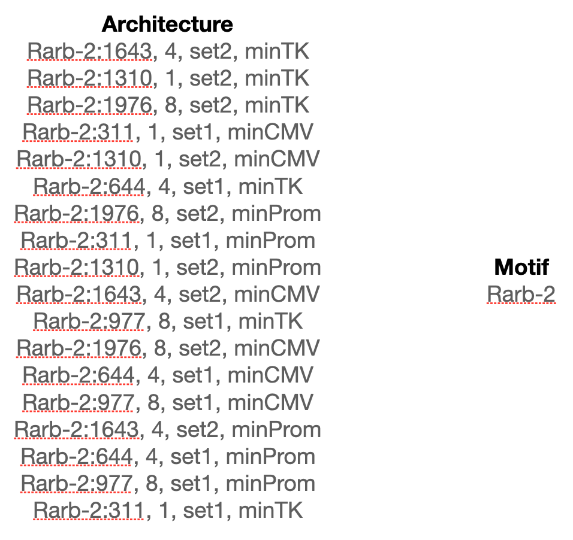

```{r, include = FALSE}
knitr::opts_chunk$set(
  collapse = TRUE,
  comment = "#>"
)
```
## Introduction
keju is a set of models for statistical inference in Massively Parallel Reporter Assay (MPRA) data. It takes in raw counts to assign each enhancer a transcription rate and, optionally, an effect size that denotes the difference between transcription rates in a control treatment and an alternate treatment. 

As a package, keju will filter and process your data for you before fitting the model. Alternatively, you can provide pre-filtered counts and skip the keju filtering step. Please just note that you must provide raw unnormalized counts (or, at the minimum, integers).

As a note on terminology, "architecture" can be a little bit confusing. To keju, an "architecture" is something to infer a transcription rate and/or differential activity for. So an "architecture" can be a ref/alt SNP pair (in which case the "control condition" would be the reference allele and the "alternate treatment" would be the alternate allele), a regulatory element in different conditions (think drug effect comparison), etc.

```{r, echo=FALSE, message=FALSE, warning=FALSE}
library(keju)
library(basilisk)
library(ggplot2)
```


### Choosing the correct keju model
Choosing the correct model can be somewhat confusing. keju is not a singular model, but a suite of models for different use cases that fit within each other, a little like Russian nesting dolls. 

To summarize the next few paragraphs,

* the simplest modeling option is `no_motif`, and that will get you most of the benefits of using keju. If you're not sure which model to use, you should probably at least start with `no_motif`.
* `motif_shrinkage` is slightly more specialized version of `no_motif`. If architectures have some kind of shared structure (i.e., multiple architectures test the same transcription factor binding motif), `motif_shrinkage` has some statistical niceties that may be of interest and slightly better performance given this motif-level metadata.
* `covariate_motif_slope_intercept` is a slightly more specialized version of `motif_shrinkage`. If you think your covariates are affecting the transcription rate of your architectures (i.e. minimal promoter choice (see our paper)), `covariate_motif_slope_intercept` can quantify those effects for you given motif-level and covariate-level metadata.

The most general model, and our default recommended starting point, is `no_motif`. `no_motif` makes no assumptions on correlations between enhancers or architectures, and shrinks transcription rate estimates and effect size estimates towards a generic standard normal prior. Use `no_motif` if you don't have a concrete structure among your tested architectures, which many users will not. Even if you do have some kind of structure, `no_motif` will give you viable estimates, just without some motif-level bells and whistles.

In contrast, some users can use `motif_shrinkage` if they have an exploitable structure in their tested architectures. An example of motif-level structure in the architectures is provided below from the [Zahm et al.](https://www.nature.com/articles/s41467-024-54502-9) data, where several architectures are all actually testing the same Rarb transcription factor binding motif. In this case, `motif_shrinkage` shrinks estimates towards a shared motif-level mean, and will also provide *motif-level* estimates for transcription rate and effect sizes, not just architecture-level estimates. For example, in the example below `no_motif` and `motif_shrinkage` will both provide 18 transcription rate estimates and 18 effect size estimates, one for each architecture. However, `motif_shrinkage` will also provide a transcription rate estimate and effect size estimate for the motif itself, and the architecture-level estimates will be regularized to these motif-level estimates. Use `motif_shrinkage` if you have some kind of structure among your architectures. If you do not know if your structure qualifies, we recommend just using `no_motif`.

<p>

</p>

Finally, the most specialized model is `covariate_motif_slope_intercept`, also the full **keju** model. `covariate_motif_slope_intercept` requires motif-level structure, and is used in the case where the covariates provided in the model have interesting effects on transcription rate that we want to disentangle. As an example, in the [Zahm et al.](https://www.nature.com/articles/s41467-024-54502-9) data, choice of minimal promoter strongly affects transcription rate estimates of each architecture (see Figure 4 in our paper). Use `covariate_motif_slope_intercept` if you want covariate-level slope and intercept estimates on transcription rate.

## Usage
### Loading the input data

We load the input data here, which contains the first 100 architectures (in alphabetical order) of SF_DEX in our paper. This data also contains a maximum of 20 barcodes per architecture for runtime's sake.
```{r setup}
library(keju)
library(dplyr)
library(stringr)

df <- readRDS(system.file("extdata", "sf_dex.rda", package="keju"))
head(df)
```

Here, we mark the control treatment (SF, denoting "Serum Free") and the negative control architectures. keju uses negative controls to correct for global shifts in differential activity, and can do so in a covariate-specific manner. We also provide the covariates we want to correct effect sizes with (in this case, it's the minimal promoter used in the architecture).
```{r}
df$is_control_treatment = (df$treatment == 'SF')
df$is_control_architecture = (df$class == 'scramble' | df$class == 'spacer')
df$covariates = str_split_fixed(df$architecture, ', ', 4)[, 4]
```

### no_motif
This section details running keju in the no_motif setting. For motif_shrinkage or covariate_motif_slope_intercept, there are other sections below. Note that the processing step also changes between different models.

Here, we build the keju object from our data. In our case, we have a control treatment (SF) and an alternate treatment (Dex), and are interested in differential activity between the two (hence, infer_differential_activity=TRUE). If you only have a single treatment, and are only interested in baseline transcription rate in that single treatment, simply set infer_differential_activity = FALSE.

Note that the DNA and RNA counts are matched by (barcode, RNA batch), and every argument in keju_from_counts is a length N vector (or castable to a length N vector), where N is the number of observations. In our experiment, we have 100 architectures, where each architecture has a maximum of 20 barcodes, and has observations in two RNA batches. This comes out to be 8230 observations, where each observation has the same barcode and RNA batch, but not necessarily the same DNA batch or DNA counts (but they can be the same!).

If this is the first time you have run keju, basilisk will install a conda environment with the necessary prerequisites for you.
```{r}
# build the keju object
keju <- keju_from_counts(
    barcode=df$barcode,
    R = df$RNA_count,
    D = df$DNA_count,
    batch = df$RNA_sample_number,
    dna_batch = df$DNA_sample_number,
    architecture = df$architecture,
    treatment = df$treatment,
    is_control_treatment = df$is_control_treatment,
    is_control_architecture = df$is_control_architecture,
    covariates=df$covariates
)

# optional filtering step
keju <- keju::filter(keju)

# process the filtered data to fit no_motif
keju <- use_no_motif(keju, infer_differential_activity = TRUE)
```

Here we set the output directory for our model outputs. keju will automatically create this directory if it finds it missing. Nicely processed estimates will be output here.

Since we are interested in the no_motif model in this subsection, we set model='no_motif'. Fitting this toy dataset only takes a few minutes, but it can take hours on a full size dataset. Generally speaking, keju also requires the use of four cores, one per fit chain. Otherwise it will fit the chains serially (see cmdstanr documentation for more).
```{r}
output_dir <- 'keju_vignette'

# fit no_motif
keju <- keju_fit(keju, output_dir=paste0(output_dir, '/no_motif'), model='no_motif', infer_differential_activity=TRUE)
```


### motif_shrinkage
This section details usage of the model motif_shrinkage. Note that both the preprocessing and fitting steps change slightly.

Because we are using motif-level information, we need to provide the appropriate metadata for preprocessing. Note that here, we are providing the motif-level information in keju_from_counts.
```{r}
df$motif = str_split_fixed(df$architecture, ':', 2)[, 1]

keju_ms <- keju_from_counts(
    barcode=df$barcode,
    R = df$RNA_count,
    D = df$DNA_count,
    batch = df$RNA_sample_number,
    dna_batch = df$DNA_sample_number,
    architecture = df$architecture,
    treatment = df$treatment,
    is_control_treatment = df$is_control_treatment,
    is_control_architecture = df$is_control_architecture,
    covariates = df$covariates,
    motif = df$motif
)
```

We still need to filter the counts, but the processing function we call is different (use_motif_shrinkage instead of use_no_motif).
```{r}
keju_ms <- keju::filter(keju_ms)
keju_ms <- use_motif_shrinkage(keju_ms, infer_differential_activity = TRUE)
```

Finally, we specify motif_shrinkage through the model argument.
```{r}
keju_ms <- keju_fit(keju_ms, paste0(output_dir, '/motif_shrinkage'), model='motif_shrinkage', infer_differential_activity=TRUE)
```

### covariate_motif_slope_intercept
This section details usage of the model covariate_motif_slope_intercept. We against start with creating the keju object and filtering counts. 
```{r}
keju_cmsi <- keju_from_counts(
    barcode=df$barcode,
    R = df$RNA_count,
    D = df$DNA_count,
    batch = df$RNA_sample_number,
    dna_batch = df$DNA_sample_number,
    architecture = df$architecture,
    treatment = df$treatment,
    is_control_treatment = df$is_control_treatment,
    is_control_architecture = df$is_control_architecture,
    covariates = df$covariates,
    motif = df$motif
)

keju_cmsi <- keju::filter(keju_cmsi)
```

Maybe predictably, the preprocessing function we use is use_covariate_slope_intercept instead of use_no_motif or use_motif_shrinkage.
```{r}
keju_cmsi <- use_covariate_slope_intercept(keju_cmsi, infer_differential_activity = TRUE)
```

We then fit the model, again specifying covariate_motif_slope_intercept through the model argument.
```{r}
keju_cmsi <- keju_fit(keju_cmsi, paste0(output_dir, '/covariate_motif_slope_intercept'), 
                 model='covariate_motif_slope_intercept', 
                 infer_differential_activity=TRUE)
```
### Accessing estimates
keju provides both transcription rate estimates (alpha) and effect size/differential activity estimates (beta). We can access both estimates as shown below. The most important columns here are mean (the mean estimate), sd (standard deviation of estimate), and is_significant.

```{r}
# alpha estimates
head(keju$alphas_estimate)

# beta estimates
head(keju$betas_estimate)
```


Note that the estimates are fairly consistent between model type, even without motif information. Using motif information improves inference, but is not strictly necessary for keju performance.

```{r}
p1 <- ggplot(mapping=aes(x=keju$alphas_estimate$mean, y=keju_ms$alphas_estimate$mean)) + geom_point() + geom_abline(slope=1, intercept=0, color='red')
print(p1)

p2 <- ggplot(mapping=aes(x=keju$betas_estimate$mean, y=keju_ms$betas_estimate$mean)) + geom_point() + geom_abline(slope=1, intercept=0, color='red')
print(p2)
```

For models with motif-level information (motif_shrinkage and covariate_motif_slope_intercept), we can access motif-level estimates in the manner shown below.
```{r}
# transcription rate motif estimates
head(keju_ms$alpha_motifs_estimate)

# effect size motif estimates
head(keju_ms$beta_motifs_estimate)
```

Finally, for covariate_motif_slope_intercept, we can access covariate-level effects on transcription rate in this manner:
```{r}
# intercept estimates
head(keju_cmsi$covariate_intercept_estimate)

# slope estimates
head(keju_cmsi$covariate_slope_estimate)
```

Thanks for using keju! Email me at albertsxue@gmail.com with any questions.